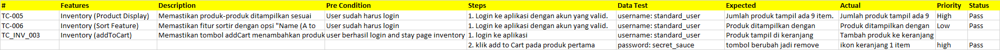

Test Case 3: Verifikasi Fungsi "Add to Cart"

Field           :   Isi

Test Case ID    :   TC_INV_003

Modul/Fitur     :   Inventory - Add to Cart

Deskripsi       :   Memastikan bahwa tombol "Add to Cart" menambahkan produk ke keranjang

Test Steps      :   1. Login ke aplikasi
                    2. Klik tombol "Add to Cart" pada produk pertama

Test Data       :   username: standard_user
                    password: secret_sauce

Pre Condition   :   User berhasil login dan berada di halaman inventory

Expected        :   Ikon keranjang menunjukkan angka 1 dan tombol berubah jadi “Remove”

Actual          :   [Diisi saat test dijalankan]

Status          :   [Pass/Fail]

# test ini menggunakan framework TestNG dan Selenium WebDriver untuk menguji fitur inventaris pada aplikasi e-commerce.

# Result Run mvn clean test
------------------------------------------
on start: TC_INV_003 -addToCart
on test start: addToCartFunctionalityTest
on test success: addToCartFunctionalityTest 

# Microsoft Excel
